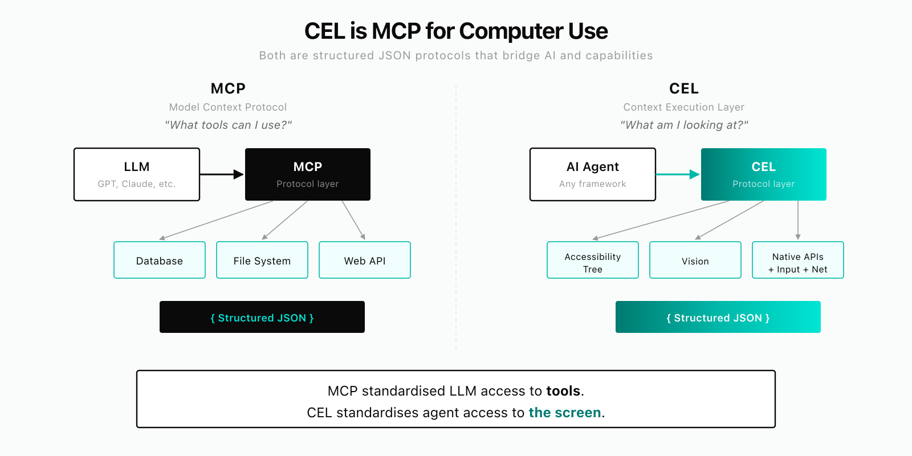
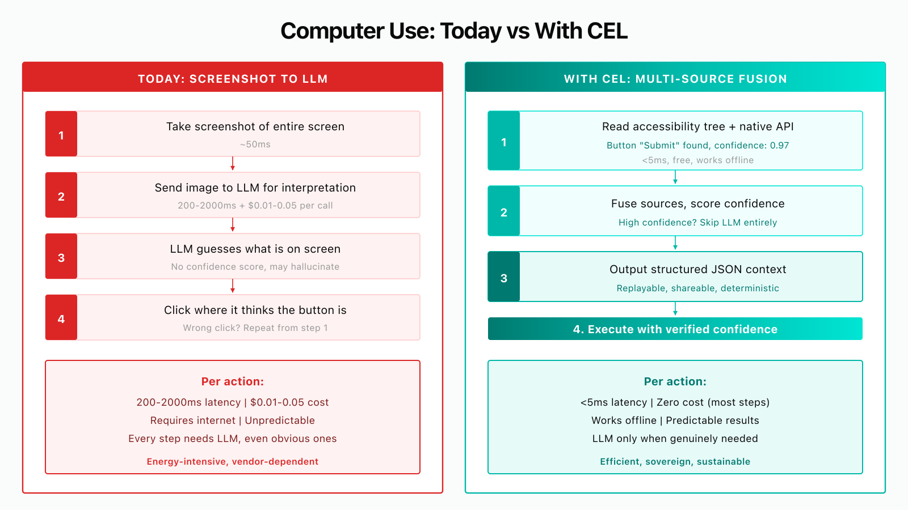
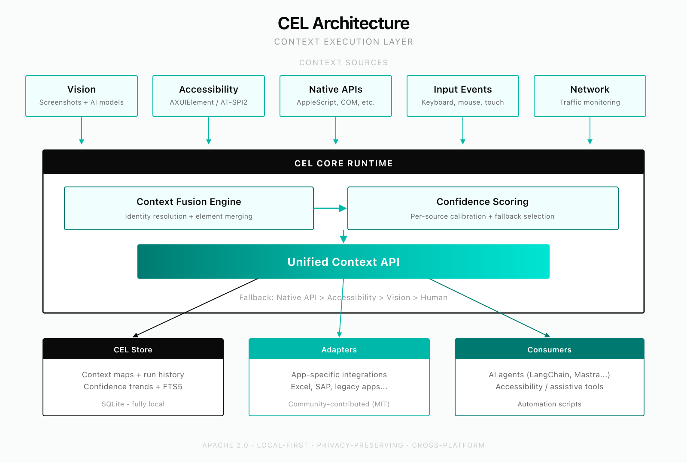

# cellar

Open source computer use runtime — powered by CEL (Context Execution Layer).

**CEL is MCP for computer use.** Where MCP gives LLMs structured access to tools, CEL gives agents structured access to what is on screen — and the ability to act on it. One protocol, any OS, any application.

> **Status: Early development (prototype).** Core architecture functional on Linux. macOS and Windows support in progress. Contributions and feedback welcome.

<p align="center">
  
</p>

## The Problem

Agentic computer use — AI that operates software through the UI — is the defining trend in AI. But it does not work reliably yet.

In browsers, agents have the DOM but still produce unstable results because they depend entirely on LLM interpretation. Outside the browser — on desktop apps, terminals, native software — it's far worse. Agents rely on screenshots alone, feeding pixels to vision models and hoping they correctly identify buttons, fields, and values.

Meanwhile, rich structured information already exists on every computer: accessibility trees, native application APIs, network traffic, input events. No tool combines these signals into a standard format that any agent can consume.

MCP solved this problem for tool access. **CEL solves it for computer use.**

<p align="center">
  
</p>

## The Solution: CEL

CEL (Context Execution Layer) is both a context extraction and execution layer. It fuses five streams into a single structured JSON output with per-element confidence scoring:

| Stream | What it provides |
|---|---|
| **Vision** | Screen capture + vision model analysis |
| **Accessibility tree** | Platform APIs (AT-SPI2, AXUIElement, UIA) |
| **Native API bridge** | App-specific adapters (Excel COM, SAP Scripting, etc.) |
| **Input layer** | Mouse/keyboard — injected, intercepted, logged, replayable |
| **Network layer** | Traffic monitoring for state change detection |

The agent calls `getContext()` and gets structured JSON with confidence scores — regardless of which source provided the data. Then it executes actions through CEL using the same multi-source approach. Workflows become replayable sequences of structured contexts and actions, not brittle screenshot-to-click chains.

Works on any interface: browser, terminal, Finder, Excel, SAP, Bloomberg — any OS, any application.

Unlike screenshot-only approaches that route every action through expensive LLM inference, CEL uses structured sources (accessibility tree, native APIs) first and escalates to vision models only when needed. Faster, cheaper, more predictable — and capable of running fully offline.

## Current State

**What works:**
- Unified context API with multi-source fusion and confidence scoring
- Linux accessibility bridge (AT-SPI2)
- Screen capture and input injection
- Vision provider integration (OpenAI, Gemini, Anthropic, custom endpoints)
- Embedded storage with semantic search (SQLite + FTS5)
- Workflow execution engine
- Training/recording system
- Live view server
- CLI scaffolding
- napi-rs bridge (Rust ↔ Node.js)

**In progress:**
- macOS accessibility bridge (AXUIElement)
- Production confidence calibration
- Portable context maps for community sharing
- First production adapter (Excel COM)
- Documentation and developer guides

## Architecture

<p align="center">
  
</p>

```
cellar/
  cel/                  ← CEL core runtime (Rust, Apache 2.0)
    cel-display/        ← screen capture
    cel-input/          ← input injection & interception
    cel-accessibility/  ← accessibility bridge (AT-SPI2, AXUIElement planned)
    cel-vision/         ← vision model integration
    cel-network/        ← traffic monitoring
    cel-context/        ← unified context API + multi-source fusion
    cel-store/          ← embedded SQLite (memory, knowledge, context maps)
    cel-llm/            ← LLM provider abstraction
    cel-napi/           ← Node.js native bindings (napi-rs)
  adapters/             ← app-specific adapters (stubs)
  agent/                ← workflow execution engine (TypeScript)
  recorder/             ← training: passive observation + explicit record
  live-view/            ← screen stream + context feed server
  registry/             ← community workflow & adapter registry (planned)
  cli/                  ← `dilipod` CLI
  box/                  ← dedicated hardware setup
```

## Getting Started

### Quickstart — see what the agent sees

No Rust build needed. Just Node.js 20+ and pnpm:

```bash
pnpm install && pnpm -r build
npx tsx examples/quickstart.ts https://github.com/login
```

This launches a browser, extracts DOM elements as structured `ContextElement`s with confidence scores, and shows what the LLM planner would receive — element IDs, types, labels, available actions. Try any URL:

```bash
npx tsx examples/quickstart.ts https://news.ycombinator.com
npx tsx examples/quickstart.ts https://example.com
```

### Prerequisites

- Node.js 20+ and pnpm 9+ (quickstart + TypeScript packages)
- Rust 1.75+ (optional — for CEL core, accessibility bridge, native bindings)
- Linux: `libatspi2.0-dev` for accessibility support

### Build

```bash
# Build everything
make build

# Or separately
make build-rust    # cargo build --workspace
make build-ts      # pnpm install && pnpm build

# Run tests
make test
```

### CLI (in development)

```bash
dilipod capture            # Capture current screen context
dilipod context            # Show unified context with confidence scores
dilipod train              # Enter training mode
dilipod run <workflow>     # Execute a workflow
```

## Benchmarks

We benchmark Cellar against other browser/computer automation tools to demonstrate the advantages of multi-source context fusion.

| Tool | Approach |
|------|----------|
| **Cellar** | Multi-source fusion (DOM + a11y + vision + network), confidence scoring, incremental updates |
| **Anthropic Computer Use** | Screenshot-only, pixel-coordinate actions via API |
| **Browser-Use (OSS)** | Hybrid screenshot + DOM (Python) |
| **Browserbase + Stagehand** | Cloud CDP + AI SDK |
| **Browser-Use Cloud** | Managed browser-use + custom model |

<!-- BENCHMARK_RESULTS_START -->
> Measured on Apple M2 Pro (arm64, 12 cores, 18GB RAM), 2026-03-18. 5 tasks, averaged across runs.

| Metric | Cellar | Computer Use | Browser-Use OSS | Browser-Use Cloud |
|--------|--------|-------------|-----------------|-------------------|
| Avg. task completion | **1.7s** | 70.4s | 42.8s | 26.6s |
| Context extraction | **130ms** | 51ms* | 4.1s | 1.3s |
| Elements detected | **1,075** | 0* | 0 | 0 |
| Shadow DOM coverage | **Yes** | No | No | No |
| LLM calls per task | **0** | 16.2 | 7.6 | 4.2 |
| Est. cost per task | **$0** | $0.79 | $0.003 | $0.002 |
| Task success rate | **100%** | 60% | 100% | 100% |

*Computer Use identifies elements visually via screenshots, not as structured data — hence 0 elements and fast "extraction" (just a screenshot).

**Key takeaways:**
- Cellar is **41x faster** than Computer Use, **25x faster** than Browser-Use OSS, and **16x faster** than Browser-Use Cloud
- Cellar requires **zero LLM calls** — structured context, not pixels or DOM-to-LLM pipelines
- Computer Use failed 40% of tasks (simple form, complex page); all other tools achieved 100%
- Cellar detects **1,075 structured elements** including shadow DOM — competitors return none
- Browser-Use OSS (with Gemini Flash) and Cloud are cheap ($0.002-0.003/task) but still 16-25x slower than Cellar
<!-- BENCHMARK_RESULTS_END -->

See `benchmarks/README.md` for full methodology, per-task breakdown, and how to reproduce.

## Contributing

See [DEVELOPMENT.md](DEVELOPMENT.md) for build instructions, project structure, and conventions.

We welcome contributions — especially:
- Accessibility bridge improvements
- New application adapters
- Test coverage for platform-specific code
- Documentation

## Platform Support

| Platform | Status |
|---|---|
| Linux | Development + CI (AT-SPI2 accessibility bridge working) |
| macOS | Planned (AXUIElement bridge in progress) |
| Windows | Planned (UI Automation bridge designed, not yet implemented) |

## License

This project uses a split license model:

- **`cel/` (CEL core runtime):** [Apache License 2.0](cel/LICENSE) — fully open source
- **Everything else** (agent, cli, box, live-view, recorder, registry): [Business Source License 1.1](LICENSE) — free to self-host and modify; converts to Apache 2.0 after 4 years
- **Adapters:** Community-contributed adapters are MIT licensed
